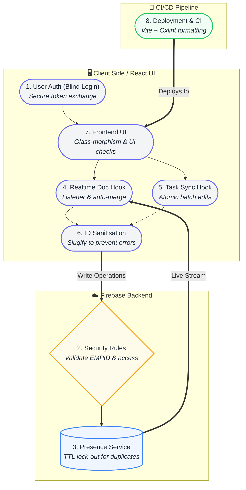

# Aideation – Real-time Collaborative Task Management

## About
**Aideation** is a premium, real-time collaborative task management workspace engineered for enterprise teams. It features a zero-trust architecture, live synchronization, and robust concurrency control to ensure seamless team productivity.

🌐 **Live Site:** [https://aideation-7gz259kdf-tejas-j-aradhyas-projects.vercel.app](https://aideation-7gz259kdf-tejas-j-aradhyas-projects.vercel.app)

## Project Overview
Aideation is a **React + TypeScript** web application built with **Vite** that provides a secure, real‑time collaborative environment for employees to create, edit, and track project tasks. It uses **Firebase Firestore** for data persistence, **Firebase Authentication** with a zero‑trust blind login, and a presence‑based concurrency lock to guarantee that the same employee ID cannot edit the same project simultaneously.

Key goals:
- **Zero‑trust UI** – employee IDs (1001‑1020) are never exposed.
- **Full read/write permissions** for all employees on task data.
- **Real‑time sync** across tabs and devices using Firestore listeners.
- **Secret protection** – `.env` files are ignored and never pushed.

## 8-Step Architecture



## Features
- Real‑time task creation, assignment, and status updates.
- Employee presence tracking and concurrency lock.
- Secure blind login without exposing employee IDs.
- Automatic secret removal and `.gitignore` enforcement.
- Premium UI with dark mode, smooth animations, and responsive layout.

## Getting Started
```bash
# Clone the repository (already set up locally)
npm install
npm run dev   # starts the Vite dev server
```
Open http://localhost:5173 in your browser.

## Deployment
```bash
npm run build   # creates a production‑ready bundle in dist/
# Deploy `dist/` to your static host of choice
```
The repository includes a GitHub Actions workflow (optional) that runs Oxlint on every push.

## Security Considerations
- **Zero‑trust login** – no employee ID is ever displayed in the UI or logs.
- **Secret scanning protection** – `.env` is excluded via `.gitignore` and removed from history.
- **Firestore rules** enforce per‑EMPID presence locks to avoid duplicate edits.

## License
MIT © 2026 Tejas Aradhya

This template provides a minimal setup to get React working in Vite with HMR and some Oxlint rules.

Currently, two official plugins are available:

- [@vitejs/plugin-react](https://github.com/vitejs/vite-plugin-react/blob/main/packages/plugin-react) uses [Oxc](https://oxc.rs)
- [@vitejs/plugin-react-swc](https://github.com/vitejs/vite-plugin-react/blob/main/packages/plugin-react-swc) uses [SWC](https://swc.rs/)

## React Compiler

The React Compiler is not enabled on this template because of its impact on dev & build performances. To add it, see [this documentation](https://react.dev/learn/react-compiler/installation).

## Expanding the Oxlint configuration

If you are developing a production application, we recommend enabling type-aware lint rules by installing `oxlint-tsgolint` and editing `.oxlintrc.json`:

```json
{
  "$schema": "./node_modules/oxlint/configuration_schema.json",
  "plugins": ["react", "typescript", "oxc"],
  "options": {
    "typeAware": true
  },
  "rules": {
    "react/rules-of-hooks": "error",
    "react/only-export-components": ["warn", { "allowConstantExport": true }]
  }
}
```

See the [Oxlint rules documentation](https://oxc.rs/docs/guide/usage/linter/rules) for the full list of rules and categories.
